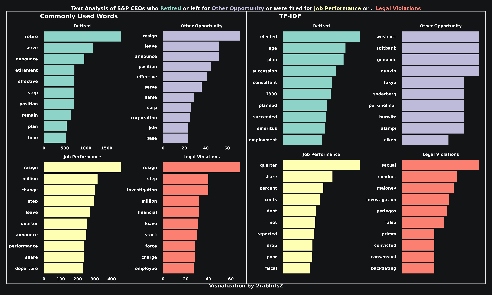
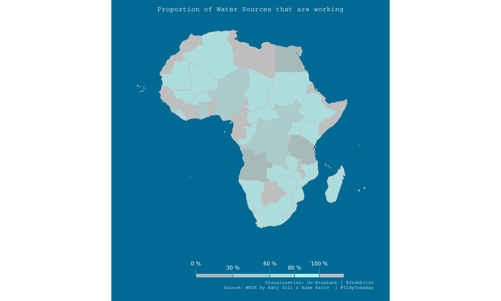
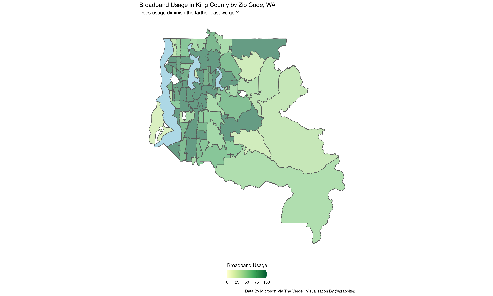

# TidyTuesday

My contributions to the #TidyTuesday challenge, a weekly project intiated by Thomas Mock and organized by the R4DS ("R for Data Science") online learning community.
Each week a new data set is shared and the community have a go at finding a story to tell from the data. Visualisations are shared via Twitter using the #TidyTuesday hashtag.
So far my contributions have focused on improving my fluency with the {tidyverse} packages including {ggplot2} and {dplyr}.

# [27-04-2021 S&P CEO CEO Departures](https://github.com/un-etudiant/TidyTuesday/tree/master/2021-04-27/)

# [04-05-2021 Water Sources](https://github.com/un-etudiant/TidyTuesday/tree/master/2021-05-04/)

# [11-05-2021 Broadband Usage in the US](https://github.com/un-etudiant/TidyTuesday/tree/master/2021-05-04/)

